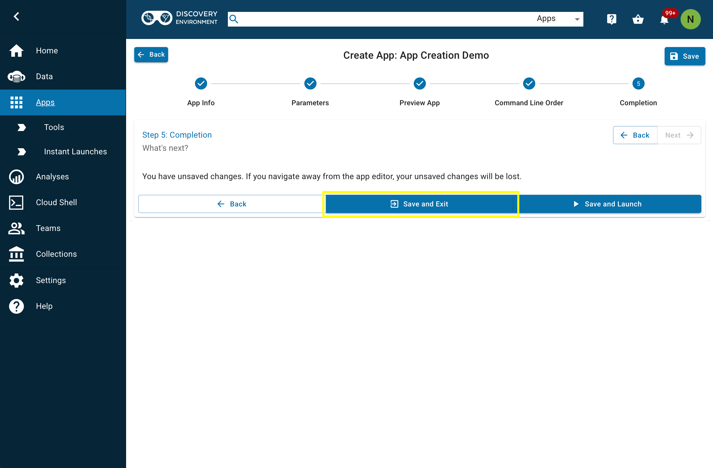

# Creating Apps Using Docker Containers in CyVerse

## Building a Docker image and pushing it to Docker Hub

1. After creating a Dockerfile that contains the desired features you would like to have in your image, open a terminal, set the current working directory to that which contains the Dockerfile and build the image using the following syntax:

```
docker build -t yourDockerUsername/yourImageName:tagName .
```

2. Log into Docker in the terminal:

```
docker login
```

- This may prompt you for a username and password or it may say "login succeeded"


3. Push the image to Docker Hub

```
docker push yourDockerUsername/yourImageName:tagName
```

4. Once the image has pushed, you will be able to see it in [Docker Hub](https://hub.docker.com)
    - You can also see it in [Docker Desktop](https://www.docker.com/products/docker-desktop/) if you go to Images &rightarrow; Hub repositories
    - Others can then pull the image to their local device using

```
docker pull yourDockerUsername/yourImageName:tagName
```

## Building an App in CyVerse
### Creating a tool

1. After successfully pushing the image to Docker Hub, you will navigate to the [CyVerse Discovery Environment](https://de.cyverse.org/dashboard)

2. From here you will go to Tools in the side menu on the left


3. Next, you will go to More Actions in the top right corner then select Add Tool


4. Give the tool a name, description, and version. Set the Type to interactive, then enter the name of the docker image you want to use (without the tag) in the Image Name field and enter the image tag in the Tag field. Next set the working directory to `/home/kasm-user/data-store` which will set the current directory when a user launches the app. Set the UID field to `1000` which will set the profile of the user to `kasm-user` within the container. Finally, set the Port Number to 6901, and **be sure to click save twice to finish creating the tool.**


- In the Tools window, you can set the filter to "Only my tools" and you should be able to see the tool you just created


### Creating an app

1. After creating the tool, go to Apps in the menu on the left and select Create App


2. Give the app a name, version, and description, then press select for the Tool used parameter


3. Select the tool you created


4. Press Next &rightarrow; Next &rightarrow; Next, modify the Command Line Preview as you see fit, press Next once more, then Save and Exit



5. Back in the apps window, open the dropdown menu where it says "Featured Apps" and select Apps Under Development


6. You will now be able to see the app you just created


## Adding GPU support to apps

- To allow your apps to utilize the GPU capabilites provided by CyVerse, you will need to contact the [CyVerse support team](https://de.cyverse.org/help) and inform them that you have created an app and you would like it to access GPUs. When doing this, include the name of the tool and the app that you want GPU accessibility for.