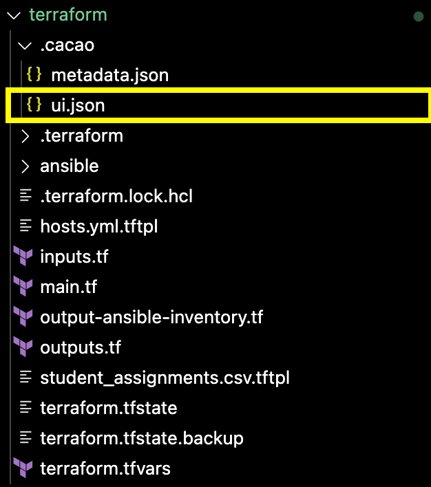
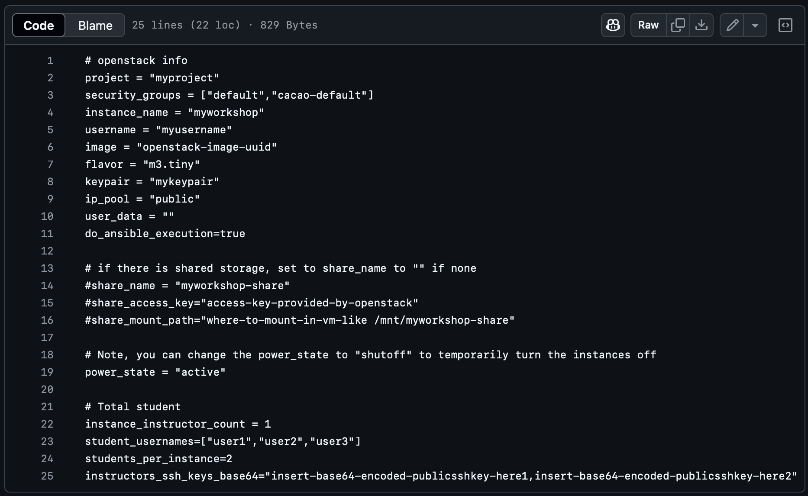
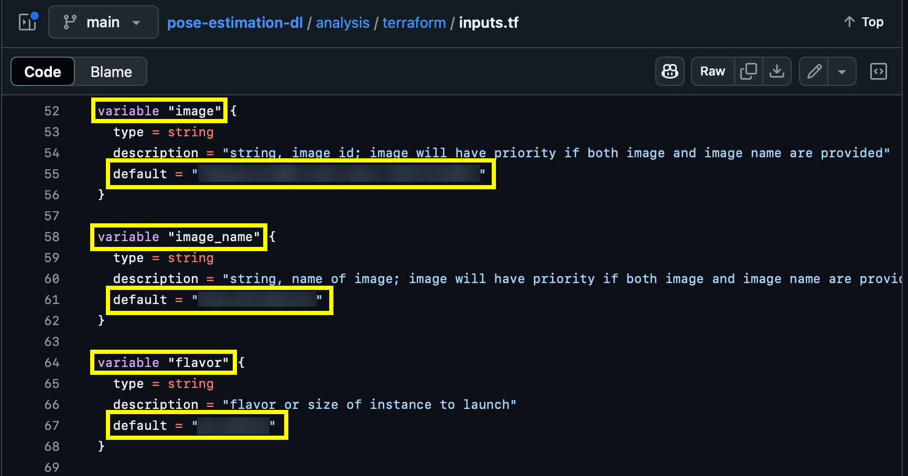
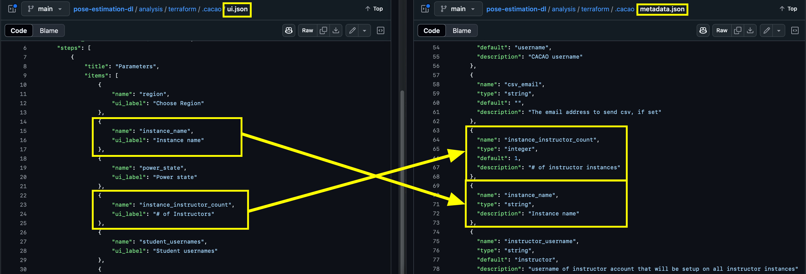

# Creating a Terraform Template for CACAO 

## Create a base image for the template

1. Before creating a Terraform template for CACAO use, create a snapshot image containing the desired software and features that will be used in the template. Refer to the [Jetstream instance creation](jetstream_instance_creation.md) instructions to do this.

2. Ensure that the snapshot image is acccessible by users outside of the project that it was created in. Refer to [Jetstream's documentation](https://docs.jetstream-cloud.org/ui/cli/snapshot-image/?h=sharing+image#sharing-an-image) on how this is done.

## Create the Terraform template

1. Find an existing repository containing Terraform files that create a template for an application similar to yours
    - Choose a template whose configuration parameters are similar to those that will be necessary for your application
        - For example if your deployment will require the specification of how many virtual machines will be needed for students, student usernames, etc., then choose an existing template with these parameters
    - The [cacao-tf-os-ops](https://gitlab.com/cyverse/cacao-tf-os-ops) project provides a collection of OpenStack Terraform templates 
    - The Terraform files used in this repository were copied from the [vms4workshop](https://gitlab.com/cyverse/cacao-tf-os-ops/-/tree/main/vms4workshop?ref_type=heads) repository with the exception of the ui.json file

2. If the Terraform files you copied do not contain a ui.json file in the `.cacao` directory, find a repository that contains a ui.json file and copy it into yours

- The ui.json file in this repository was copied from the [cacao-tf-os-ops single-image](https://gitlab.com/cyverse/cacao-tf-os-ops/-/tree/main/single-image?ref_type=heads) repository

3. Update the terraform.tfvars file to include the appropriate information about your project by modifying the following:

- `project`: the name of your project's allocation (e.g. SOT829133)
- `instance_name`: a descriptive instance name
- `username`: your ACCESS username (e.g. yourusername@access-ci.org)
- `image`: the ID of the image you created which you can find [here](https://js2.jetstream-cloud.org/project/images)
- `flavor`: the default size of the instance that will be created (e.g. m3.medium, g3.large)
- `keypair`: the name of one of your keypairs found [here](https://js2.jetstream-cloud.org/project/key_pairs)
- Comment out the `share_name`, `share_access_key`, `share_mount_path`, and `instructors_ssh_keys_base64` variables

4. Modify the inputs.tf file to specify the default values that will be used for the parameters. This will include the image that will be used to create the instances, the size of the instance, etc.

- In the `image` parameter, set the default value to be the ID of the image you created
- Set the `image_name` parameter to be the name of the image you created
- Set the `flavor` parameter to be the size of the instance that is required for your application

4. Modify the ui.json file to include the necessary configuration parameters, ensuring that any parameters listed in the ui.json file are also present in the metadata.json file.

5. After making the necessary modifications to the ui.json and metadata.json files, open a terminal and set the working directory to the folder containing the Terraform files. 

6. Authenticate the OpenStack CLI (Log in) by running an `openrc.sh` script
    - If you don't have an `openrc.sh` script then you can generate one using the instructions found [here](https://docs.jetstream-cloud.org/ui/cli/auth/?h=openrc)

7. Run `terraform init` to initialize Terraform

8. Run `terraform apply` to execute the actions defined in the Terraform files

## Importing the template to CACAO

- After you have modified the Terraform files in your repository accordingly, follow the steps found [here](https://docs.jetstream-cloud.org/ui/cacao/cacao_cli_import_terraform_template/) regarding how to import the template to CACAO using the CACAO CLI