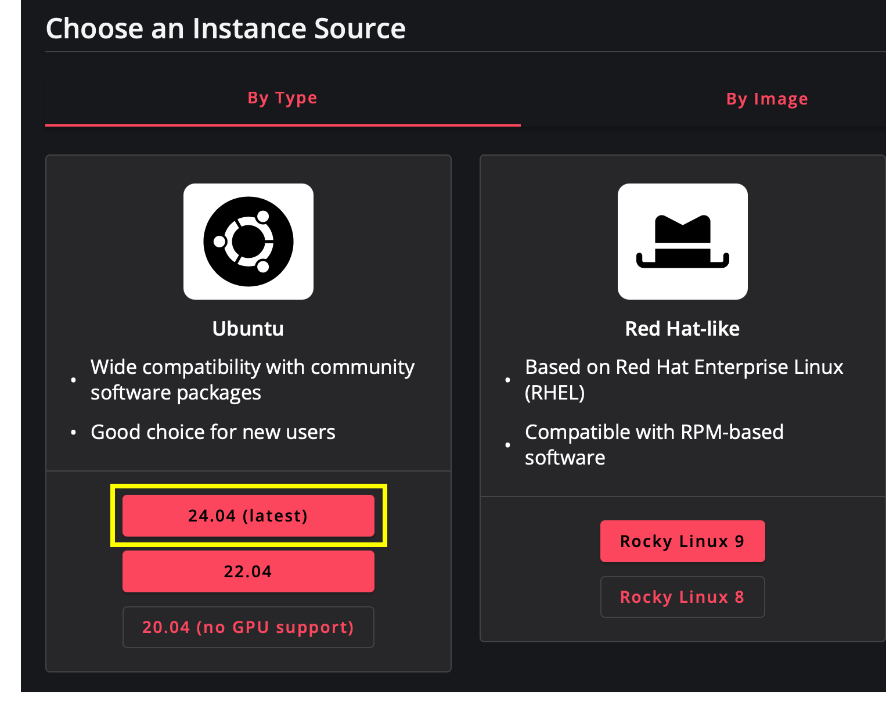
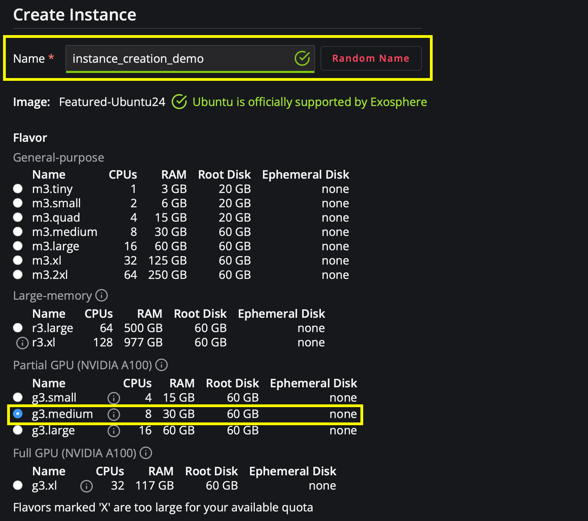
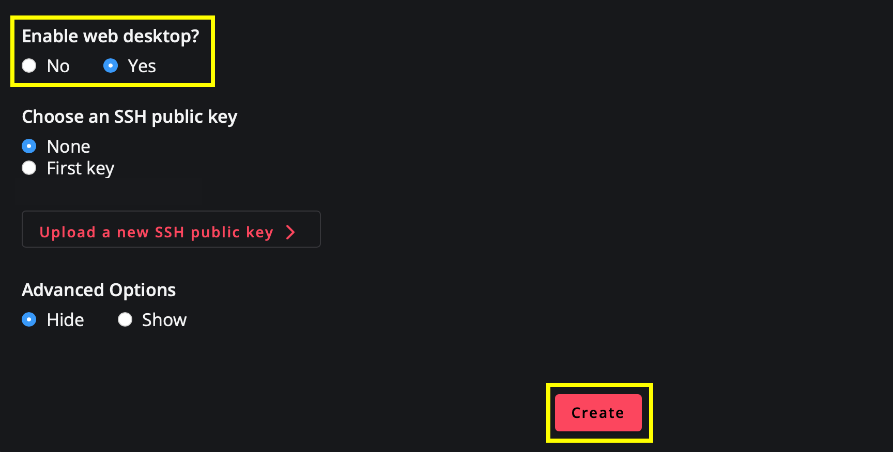
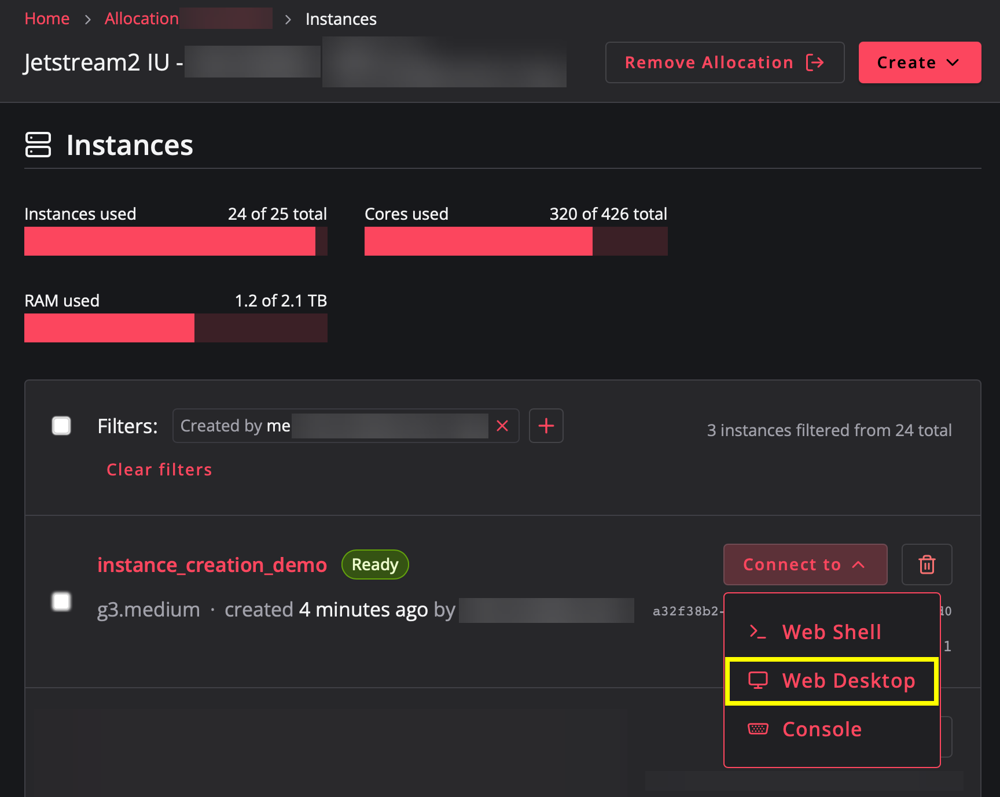
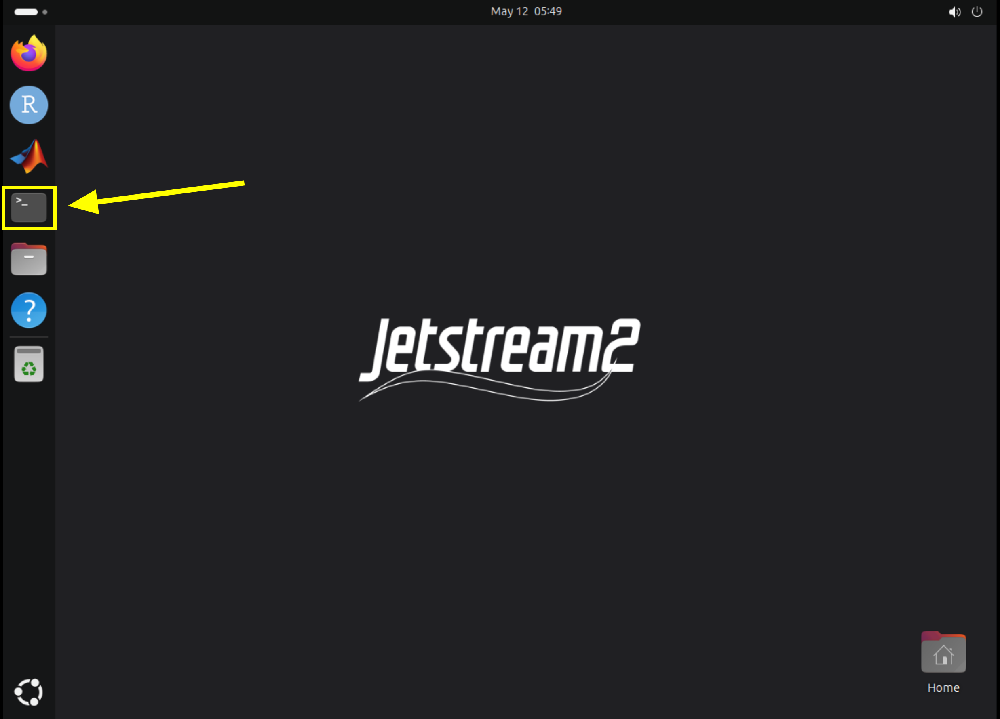
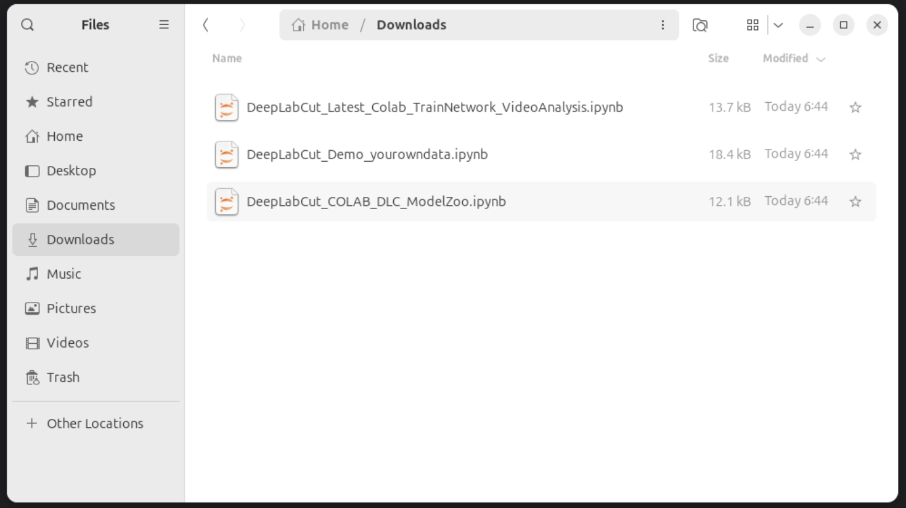
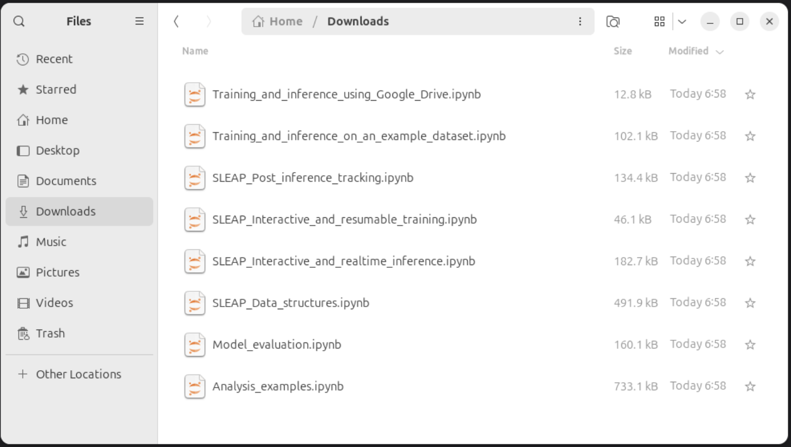

# Creating a Jetstream Instance through Exosphere and installing DeepLabCut, SLEAP, and Jupyter 

## Create a base Jetstream instance

1. In your allocation, go to Create and select Instance


2. Choose the latest Ubuntu image as the instance source



3. When configuring the instance, give it a name, select the g3.medium flavor, and enable the web desktop





4. Once the instance has finished building, navigate to its web desktop



## Conda installation

1. Open the terminal in the web desktop



2. Paste and run the following code:

```
wget --quiet https://repo.anaconda.com/miniconda/Miniconda3-latest-Linux-x86_64.sh -O ~/miniconda.sh
```

2. Set the permissions of miniconda.sh to read, write, and execute

```
sudo chmod 777 miniconda.sh
```

3. Install conda in /home/exouser

```
~/miniconda.sh -b -p /home/exouser/miniconda3
```

5. Add conda to path

```
export PATH=/home/exouser/miniconda3/bin:$PATH
```

4. Initialize conda

```
conda init
```

5. Restart the terminal

```
 source ~/.bashrc
```

6. Activate the base conda environment

```
 conda activate base
```

7. Install conda dependencies

```
conda install -c conda-forge mamba -y
```

## Add other installations

1. Install nvitop to monitor GPU usage

```
pip install nvitop
```

2. Install Filezilla

```
sudo apt update
sudo apt install filezilla -y
```
 - Confirm installation with ```filezilla &```
 - Drag it's desktop icon into the pinned apps on the dock

## [Installing DeepLabCut](https://deeplabcut.github.io/DeepLabCut/docs/installation.html)
1. Create a yaml file for DeepLabCut’s environment creation

```
vim DEEPLABCUT.yaml
```

2. Copy the contents from [here](https://github.com/DeepLabCut/DeepLabCut/blob/main/conda-environments/DEEPLABCUT.yaml) into the yaml file
- After doing ```vim DEEPLABCUT.yaml``` in the terminal, perform the following steps:
    1. Copy the raw yaml file from the link
    2. In the file, press ```i``` to enter INSERT mode
    3. Paste the contents into the file
    4. Press ```esc```
    5. Type ```:wq``` and press ```enter``` to save and exit the file

2. Create the DeepLabCut environment

```
conda env create -f DEEPLABCUT.yaml
```

## [Installing SLEAP](https://sleap.ai/installation.html)

1. Create the SLEAP conda environment and install SLEAP

```
conda create -y -n sleap -c conda-forge -c nvidia -c sleap/label/dev -c sleap -c anaconda sleap=1.4.1
```

## Test the installations were successful

Navigate to the Jetstream instance's Web Desktop, open a terminal, and perform the following steps:

### DeepLabCut

1. Activate the DeepLabCut environment

```
conda activate DEEPLABCUT
```

2. Launch the GUI

```
python -m deeplabcut
```

3. Exit the GUI

4. Deactivate DeepLabCut environment

```
 conda deactivate
```

### SLEAP
1. Activate the SLEAP environment
```
conda activate sleap
```

2. Verify the GPU is successfully detected

```
python3 -c "import tensorflow as tf; print(tf.config.list_physical_devices('GPU'))"
```

3. Check the versions installed

```
python3 -c "import sleap; sleap.versions()"
```

4. Check the system summary

```
python3 -c "import sleap; sleap.system_summary()"
```

5. Launch the GUI

```
sleap-label
```

## Setup the environment and notebook files for Jupyter

### Jupyter environment creation

1. Create a conda environment with Jupyter installed:

```
conda create -n jupyter python=3.10 ipython jupyter nb_conda 'notebook<7.0.0' -y
```

### Download DeepLabCut and SLEAP notebooks

1. Create new directories to store the notebooks

```
mkdir -p /home/exouser/jupyter_notebooks/deeplabcut
```

```
mkdir /home/exouser/jupyter_notebooks/sleap
```

2. Download the [DeepLabCut notebooks](https://github.com/DeepLabCut/DeepLabCut/blob/main/examples/README.md)   
    1. [Demo on your own data](https://github.com/DeepLabCut/DeepLabCut/blob/main/examples/JUPYTER/Demo_yourowndata.ipynb)
    2. [Training and evaluating a network](https://colab.research.google.com/github/DeepLabCut/DeepLabCut/blob/master/examples/COLAB/COLAB_YOURDATA_TrainNetwork_VideoAnalysis.ipynb)
    3. [Model Zoo](https://colab.research.google.com/github/DeepLabCut/DeepLabCut/blob/master/examples/COLAB/COLAB_DLC_ModelZoo.ipynb)



4. Move the DeepLabCut notebooks to the proper directory

    - If the DeepLabCut notebooks are the only files in the Downloads folder then you can do:

```
mv ~/Downloads/* ~/jupyter_notebooks/sleap
```

<!-- bullet format -->

    - Otherwise if there are other files in the downloads folder:

```
cd ~/Downloads
```

```
mv DeepLabCut_Latest_Colab_TrainNetwork_VideoAnalysis.ipynb DeepLabCut_Demo_yourowndata.ipynb DeepLabCut_COLAB_DLC_ModelZoo.ipynb /home/exouser/jupyter_notebooks/deeplabcut
```

5. Download the [SLEAP notebooks](https://sleap.ai/notebooks/index.html)
    1. [Training and inference on an example dataset](https://colab.research.google.com/github/talmolab/sleap/blob/main/docs/notebooks/Training_and_inference_on_an_example_dataset.ipynb)
    2. [Training and inference on your own data](https://colab.research.google.com/github/talmolab/sleap/blob/main/docs/notebooks/Training_and_inference_using_Google_Drive.ipynb)
    3. [Analysis examples](https://colab.research.google.com/github/talmolab/sleap/blob/main/docs/notebooks/Analysis_examples.ipynb)
    4. [Data structures](https://colab.research.google.com/github/talmolab/sleap/blob/main/docs/notebooks/Data_structures.ipynb)
    5. [Post inference tracking](https://colab.research.google.com/github/talmolab/sleap/blob/main/docs/notebooks/Post_inference_tracking.ipynb)
    6. [Interactive training](https://colab.research.google.com/github/talmolab/sleap/blob/main/docs/notebooks/Interactive_and_resumable_training.ipynb)
    7. [Interactive and realtime inference](https://colab.research.google.com/github/talmolab/sleap/blob/main/docs/notebooks/Interactive_and_realtime_inference.ipynb)
    8. [Model evaluation](https://colab.research.google.com/github/talmolab/sleap/blob/main/docs/notebooks/Model_evaluation.ipynb)



6. Move the SLEAP notebooks to the proper directory

    - If the SLEAP notebooks are the only files in the Downloads folder:

```
mv ~/Downloads/* ~/jupyter_notebooks/sleap
```

<!-- bullet format -->

    - Otherwise if there are other files in the downloads folder:

```
cd ~/Downloads
```

```
mv Training_and_inference_using_Google_Drive.ipynb Training_and_inference_on_an_example_dataset.ipynb SLEAP_Post_inference_tracking.ipynb SLEAP_Interactive_and_resumable_training.ipynb SLEAP_Interactive_and_realtime_inference.ipynb SLEAP_Data_structures.ipynb Model_evaluation.ipynb Analysis_examples.ipynb
```


## Create Desktop shortcuts for SLEAP, DeepLabCut, Jupyter, and nvitop

### SLEAP desktop shortcut

1. Download the SLEAP icon from https://sleap.ai/installation.html
    - Open the side menu on the left and download the image
    - Save the image as sleapIcon.png

2. Create a launch_sleap.sh file

```
vim ~/launch_sleap.sh
```

3. Paste the following contents in the .sh file

```
#!/bin/bash                                                                     
{
source /home/exouser/miniconda3/etc/profile.d/conda.sh
conda init
source /home/exouser/.bashrc
conda activate sleap
} > /dev/null 2>&1
sleap-label
```

- After doing ```vim ~/launch_sleap.sh``` in the terminal, perform the following steps:
    1. Copy the contents from the code chunk
    2. In the file, press ```i``` to enter INSERT mode
    3. Paste the contents into the file
    4. Press ```esc```
    5. Type ```:wq``` and press ```enter``` to save and exit the file

4. Set the right permissions

```
chmod +x ~/launch_sleap.sh
```

5. Create a .desktop file

```
vim ~/.local/share/applications/sleap.desktop
```

6. Paste the following contents in the .desktop file

```
[Desktop Entry]
Version=1.0
Type=Application
Name=SLEAP
Comment=Launch SLEAP GUI
Exec=/home/exouser/launch_sleap.sh
Icon=/home/exouser/Downloads/sleapIcon.png
Terminal=true
Categories=Development;
```

- After doing ```vim ~/.local/share/applications/sleap.desktop``` in the terminal, perform the following steps:
    1. Copy the contents from the code chunk
    2. In the file, press ```i``` to enter INSERT mode
    3. Paste the contents into the file
    4. Press ```esc```
    5. Type ```:wq``` and press ```enter``` to save and exit the file

7. Set the right permissions

```
chmod +x ~/.local/share/applications/sleap.desktop
```

8. Open all applications with the "Show Apps" icon in the bottom left hand corner of the Web Desktop

9. Drag the SLEAP icon into the dock


### DeepLabCut desktop shortcut

1. Download the DeepLabCut icon from https://deeplabcut.github.io/DeepLabCut/docs/installation.html
    - Open the side menu on the left and download the image
    - Save the image as deeplabcutIcon.png

2. Create a launch_deeplabcut.sh file

```
vim ~/launch_deeplabcut.sh
```

3. Paste the following contents in the .sh file

```
#!/bin/bash                                                                     
{
source /home/exouser/miniconda3/etc/profile.d/conda.sh
conda init
source /home/exouser/.bashrc
conda activate DEEPLABCUT
} > /dev/null 2>&1
python -m deeplabcut
```

- After doing ```vim ~/launch_deeplabcut.sh``` in the terminal, perform the following steps:
    1. Copy the contents from the code chunk
    2. In the file, press ```i``` to enter INSERT mode
    3. Paste the contents into the file
    4. Press ```esc```
    5. Type ```:wq``` and press ```enter``` to save and exit the file

4. Set the right permissions

```
chmod +x ~/launch_deeplabcut.sh
```

5. Create a .desktop file

```
vim ~/.local/share/applications/deeplabcut.desktop
```

6. Paste the following contents in the .desktop file

```
[Desktop Entry]
Version=1.0
Type=Application
Name=DEEPLABCUT
Comment=Launch DEEPLABCUT GUI
Exec=/home/exouser/launch_deeplabcut.sh
Icon=/home/exouser/Downloads/deeplabcutIcon.png
Terminal=true
Categories=Development;
```

- After doing ```vim ~/.local/share/applications/deeplabcut.desktop``` in the terminal, perform the following steps:
    1. Copy the contents from the code chunk
    2. In the file, press ```i``` to enter INSERT mode
    3. Paste the contents into the file
    4. Press ```esc```
    5. Type ```:wq``` and press ```enter``` to save and exit the file

7. Set the right permissions

```
chmod +x ~/.local/share/applications/deeplabcut.desktop
```

8. Open all applications with the "Show Apps" icon in the bottom left hand corner of the Web Desktop

9. Drag the DeepLabCut icon into the dock

### Jupyter desktop shortcut

1. Download the Jupyter icon from the web browser and save it as "jupyterIcon.png"

2. Create a launch_jupyter.sh file

```
vim ~/launch_jupyter.sh
```

3. Paste the following contents in the .sh file

```
#!/bin/bash              
{
source /home/exouser/miniconda3/etc/profile.d/conda.sh
conda init
source /home/exouser/.bashrc
conda activate jupyter
cd /home/exouser/jupyter_notebooks
} > /dev/null 2>&1
jupyter notebook
```

- After doing ```vim ~/launch_jupyter.sh``` in the terminal, perform the following steps:
    1. Copy the contents from the code chunk
    2. In the file, press ```i``` to enter INSERT mode
    3. Paste the contents into the file
    4. Press ```esc```
    5. Type ```:wq``` and press ```enter``` to save and exit the file

4. Set the right permissions

```
chmod +x ~/launch_jupyter.sh
```

5. Create a .desktop file

```
vim ~/.local/share/applications/jupyter.desktop
```

6. Paste the following contents in the .desktop file

```
[Desktop Entry]
Version=1.0
Type=Application
Name=Jupyter
Comment=Launch Jupyter
Exec=/home/exouser/launch_jupyter.sh
Icon=/home/exouser/Downloads/jupyterIcon.png
Terminal=false
Categories=Development;
```

- After doing ```vim ~/.local/share/applications/jupyter.desktop``` in the terminal, perform the following steps:
    1. Copy the contents from the code chunk
    2. In the file, press ```i``` to enter INSERT mode
    3. Paste the contents into the file
    4. Press ```esc```
    5. Type ```:wq``` and press ```enter``` to save and exit the file

7. Set the right permissions

```
chmod +x ~/.local/share/applications/jupyter.desktop
```

8. Open all applications with the "Show Apps" icon in the bottom left hand corner of the Web Desktop

9. Drag the Jupyter icon into the dock

### nvitop desktop shortcut

1. Download an image to use as the nvitop icon from the web browser and save it as "nvitopIcon.png"

2. Create a launch_nvitop.sh file

```
vim ~/launch_nvitop.sh
```

3. Paste the following contents in the .sh file

```
#!/bin/bash                                                                     
{
source /home/exouser/miniconda3/etc/profile.d/conda.sh
conda init
source /home/exouser/.bashrc
conda activate base
} > /dev/null 2>&1
nvitop
```

- After doing ```vim ~/launch_nvitop.sh``` in the terminal, perform the following steps:
    1. Copy the contents from the code chunk
    2. In the file, press ```i``` to enter INSERT mode
    3. Paste the contents into the file
    4. Press ```esc```
    5. Type ```:wq``` and press ```enter``` to save and exit the file

4. Set the right permissions

```
chmod +x ~/launch_nvitop.sh
```

5. Create a .desktop file

```
vim ~/.local/share/applications/nvitop.desktop
```

6. Paste the following contents in the .desktop file

```
[Desktop Entry]
Version=1.0
Type=Application
Name=nvitop
Comment=Launch nvitop
Exec=/home/exouser/launch_nvitop.sh
Icon=/home/exouser/Downloads/nvitopIcon.png
Terminal=true
Categories=Development;
```

- After doing ```vim ~/.local/share/applications/nvitop.desktop``` in the terminal, perform the following steps:
    1. Copy the contents from the code chunk
    2. In the file, press ```i``` to enter INSERT mode
    3. Paste the contents into the file
    4. Press ```esc```
    5. Type ```:wq``` and press ```enter``` to save and exit the file

7. Set the right permissions

```
chmod +x ~/.local/share/applications/nvitop.desktop
```

8. Open all applications with the "Show Apps" icon in the bottom left hand corner of the Web Desktop

9. Drag the nvitop icon into the dock