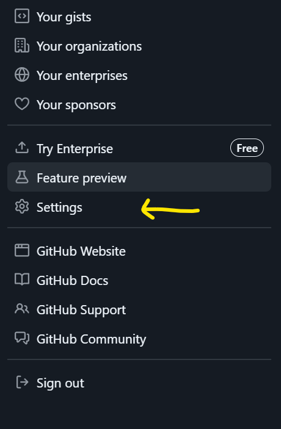
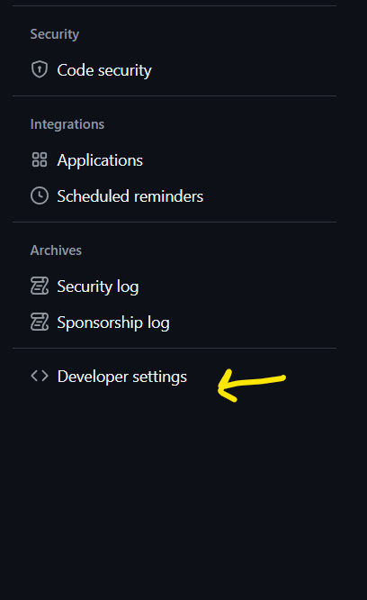
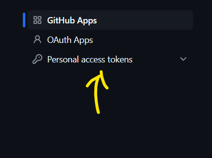
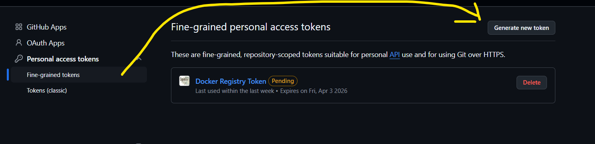
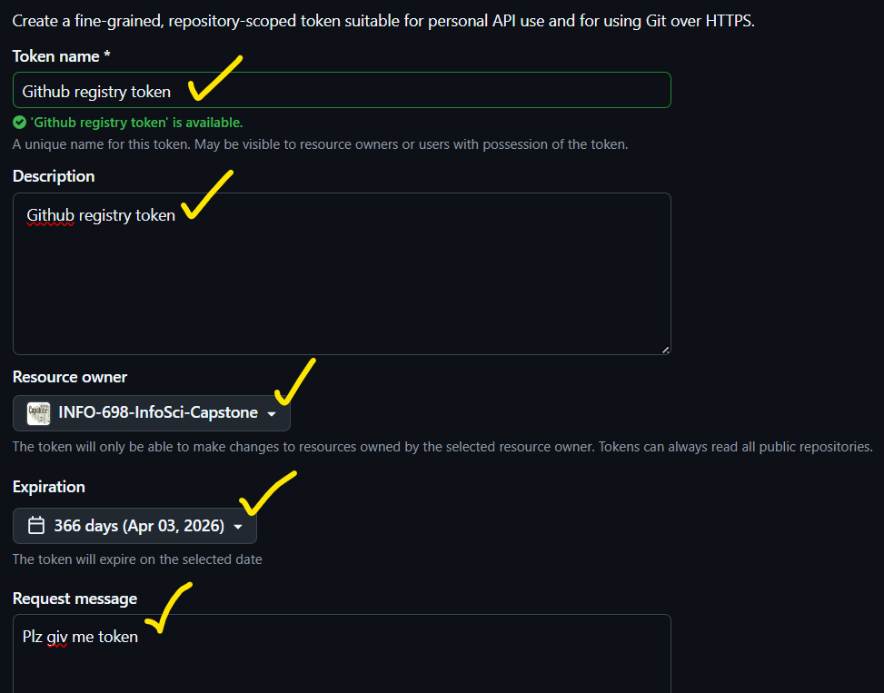
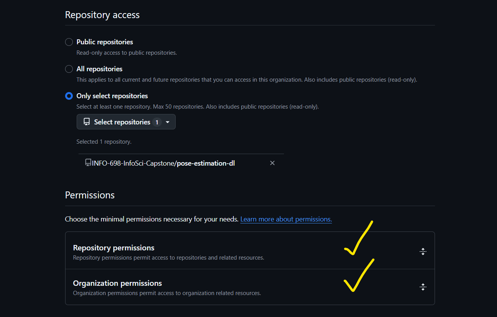
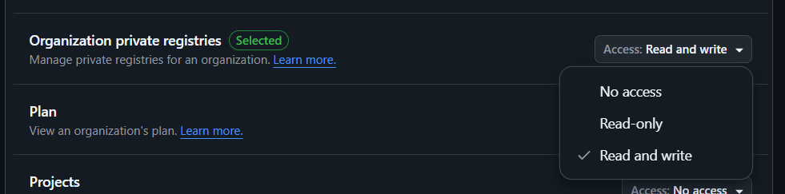

https://docs.github.com/en/authentication/keeping-your-account-and-data-secure/managing-your-personal-access-tokens#keeping-your-personal-access-tokens-secure
















Generate token and request access

COPY THE TOKEN! PUT IT SOMEWHERE SAFE!

Go to your terminal/ command line and run the following

YOUR_TOKEN is the one you generated and copied
```
docker login ghcr.io -u <YOUR_GITHUB_USERNAME> -p <YOUR_TOKEN>
```

you might need to double check your docker desktop for what you named that local image
```
docker tag <LOCAL_IMAGE_NAME> ghcr.io/info-698-infosci-capstone/<name-you-want-for-image-in-registry>
```

```
docker tpush ghcr.io/info-698-infosci-capstone/<name-you-want-for-image-in-registry>
```
